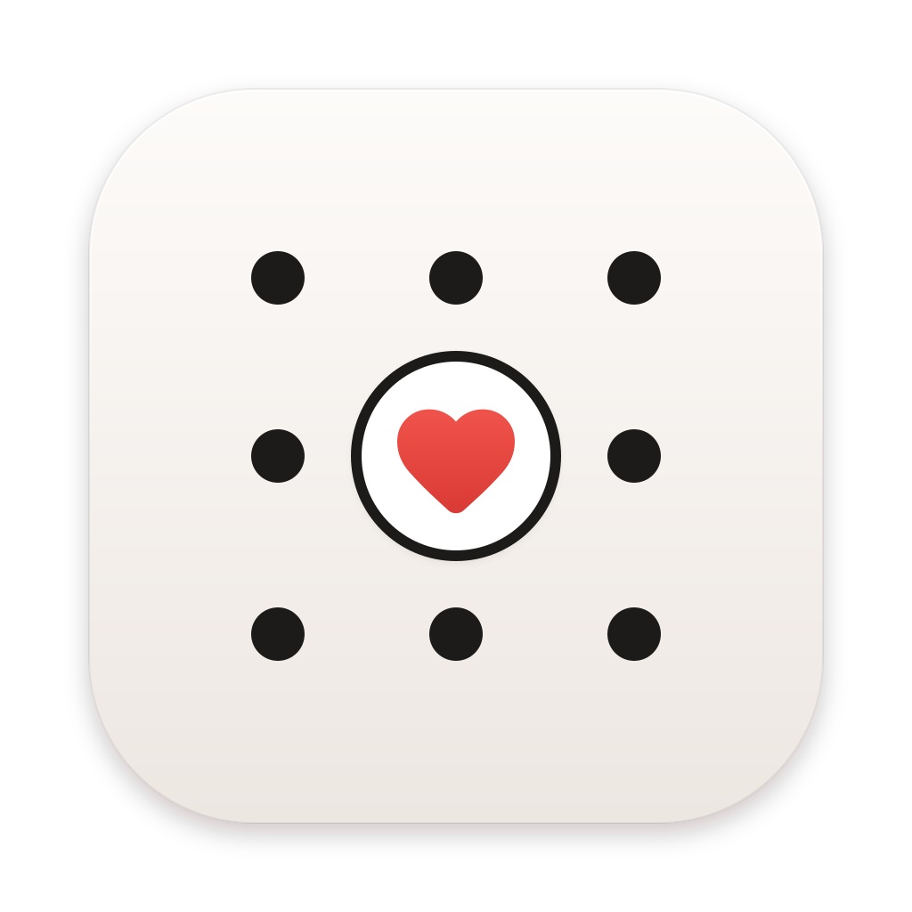
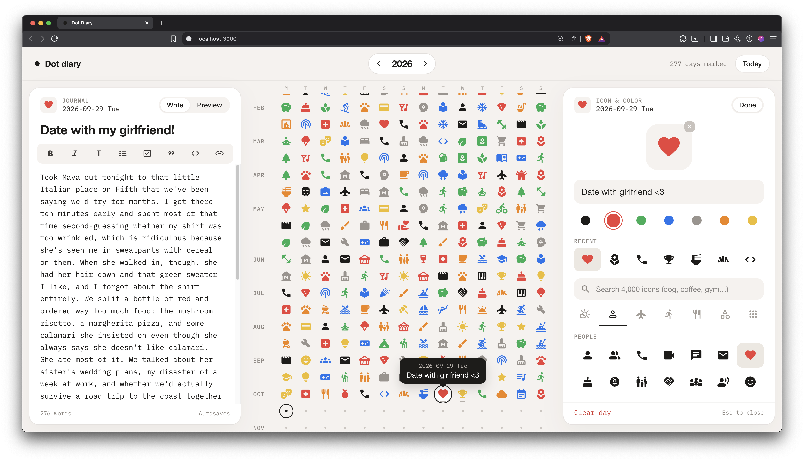

<p align="center">
  
</p>

<h1 align="center">Dot Diary</h1>

A year-at-a-glance diary that runs on your own computer. Every day is a dot: click one, give it an icon and a few words about what mattered most, and keep a longer markdown journal alongside it.

- **Dot calendar:** a full year of days in one grid, with today and the selected day highlighted.
- **Quick entry:** click a day, type a few words, tap an icon. Done.
- **Day editor:** seven colors, curated icon categories, and search over all ~4,000 Material Symbols.
- **Journal:** a markdown entry per day, with a formatting toolbar, preview and autosave.
- **Any year:** step between years, or show earlier and later years in the same grid.

Everything is stored in a local SQLite database file. Nothing goes to the cloud. The only outside calls are to Google Fonts, for the icons and the IBM Plex Mono font.

## Requirements

- [Node.js](https://nodejs.org) **22.13 or newer**. Nothing else is needed. The database is Node's built-in SQLite, so there are no native modules to compile.

## Getting started

```bash
git clone <this repo> dot-diary
cd dot-diary
npm install
npm start
```

Then open **http://localhost:3000**.

On first run the app creates an empty diary in `data/dot-diary.sqlite`. To look around with some sample days and a journal entry first, run `npm run seed` (it only fills an empty database).

The first load needs an internet connection, since icons and fonts come from Google Fonts.

## Using it

- **Click a day** to open a quick popover. Type a few words, then tap an icon, or press **Enter** to save with a default icon.
- **`…` in the popover** opens the full editor: colors, a bigger preview, curated icon categories, an **All icons** tab and a **search box** over every Material Symbol. Search covers names and tags, so "dog" finds `pets`. Changes save as you go.
- **Journal (left panel)** always shows the last day you clicked. Write in markdown and switch to **Preview** to see it rendered. It saves automatically.
- Days with a journal entry get a small bar under their dot.
- **Year stepper** in the top bar: **‹ ›** jump to the previous or next year, or click the year, type one and press **Enter**. The **Show _year_** buttons above and below the grid add the year before or after.
- **Esc** closes the popover and the editor.

## Scripts

| Command         | What it does                                                        |
| --------------- | ------------------------------------------------------------------- |
| `npm start`     | Start the app                                                       |
| `npm run dev`   | Start and restart automatically when files change                   |
| `npm run seed`  | Fill an empty database with sample days and a journal entry         |
| `npm run icons` | Re-download the icon list (`public/data/icons.json`) from Google    |

## Configuration

Optional environment variables:

| Variable  | Default                | Meaning                          |
| --------- | ---------------------- | -------------------------------- |
| `PORT`    | `3000`                 | Port to listen on                |
| `DB_PATH` | `data/dot-diary.sqlite` | Where the SQLite database lives |

For example: `PORT=4000 npm start`.

The server listens on all network interfaces, so other devices on your network can reach it at your computer's address. There is no login.

To change how many days appear per row, edit `GRID_COLUMNS` in `public/js/constants.js` (7, 14 or 21).

## Your data

- Everything (day icons, colors, labels and journal entries) is in a single file: `data/dot-diary.sqlite` (ignored by git).
- **Back up:** stop the app and copy that file. **Restore:** put the copy back.
- **Start over:** stop the app and delete the file. An empty diary is created on the next start.

## API

| Method | Path                 | Body                                |
| ------ | -------------------- | ----------------------------------- |
| GET    | `/api/days`          | → `{ days, recentIcons }`           |
| PUT    | `/api/days/:date`    | `{ icon, color, label }`            |
| DELETE | `/api/days/:date`    |                                     |
| GET    | `/api/journal`       | → `{ dates }` with entries          |
| GET    | `/api/journal/:date` | → `{ title, body }`                 |
| PUT    | `/api/journal/:date` | `{ title, body }` (empty → deleted) |

`:date` is `YYYY-MM-DD`. Colors are `black`, `red`, `green`, `blue`, `gray`, `orange` and `yellow`. Icons are [Material Symbols](https://fonts.google.com/icons) names.

## How it's built

A single Node.js process serves both the API and the web app.

```
assets/
  icon.svg              App icon
server.js               Express app: static files and API routes
src/
  db.js                 SQLite schema and queries (node:sqlite)
  validate.js           Input checks: dates, icons, colors
  routes/days.js        /api/days: icon, color and label per day
  routes/journal.js     /api/journal: markdown journal per day
scripts/
  seed.js               `npm run seed`: sample data
  build-icon-list.js    `npm run icons`: builds public/data/icons.json (all icons plus search tags)
public/
  index.html            Page structure
  css/styles.css        All styles, with color tokens on :root
  data/icons.json       Every icon name plus search tags
  js/
    app.js              Entry point: wires the pieces together
    store.js            App state, actions and change events
    api.js              fetch wrapper for the API
    calendar.js         The dot grid
    popover.js          Quick-entry popover
    editor.js           Full day editor panel
    journal.js          Journal panel and markdown toolbar
    year-picker.js      Year stepper (‹ 2026 ›)
    icon-library.js     Loads and searches the full icon list
    markdown.js         Small markdown renderer
    constants.js        Colors, icon categories, grid width
    dates.js            Date helpers
```

- **Frontend:** plain JavaScript as native ES modules, with no framework, bundler or build step.
- **Icons and fonts:** [Material Symbols Rounded](https://fonts.google.com/icons) and [IBM Plex Mono](https://fonts.google.com/specimen/IBM+Plex+Mono) from Google Fonts.
- **Backend:** [Express 5](https://expressjs.com) plus the built-in `node:sqlite`.
- **Tables:** `days` (one row per marked day: icon, color, label) and `journal` (one row per day with an entry: title and markdown body).

## Screenshots

**Diary:** a year of days in the dot grid, with the journal for the selected day on the left and the icon and color editor on the right.


